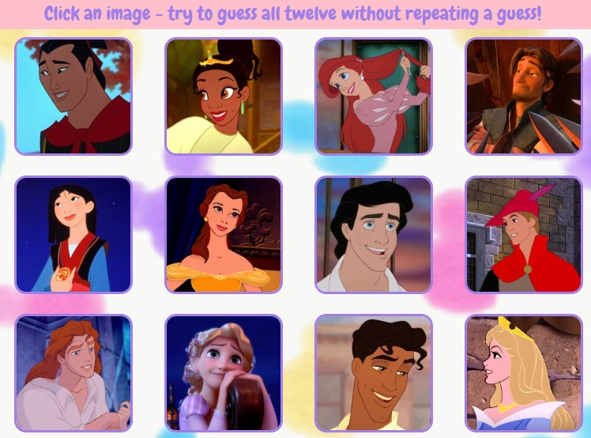

# clicky-game-memory
memory game with react
heroku link: https://stormy-castle-50493.herokuapp.com/

# Overview
The goal of this game is to click all of the pictures without clicking on the same one twice. It is built in React.

# Gameplay
The game is all contained on one page. On loading the page, the user sees a grid of twelve images. 

When the user clicks an image, if they haven't previously clicked it, their score will go up by 1 and the images will shuffle. The user continutes to click images either until they click one they've already clicked before (at which point their score goes to zero and they have to start over) or until they successfully click all the images with no repeats. If they win, they'll get a frienly alert that they won and their score will go back to zero to play again. 

The game also keeps track of the high score (which can't go above twelve as there are twelve images total). 

The navbar also displays a message that changes based on if the user clicks a hitherto unclicked image or if it's one they've clicked before. 
 vs. 

# Improvements
* The method used to shuffle the images is a version of the sort method - the compare function uses a random number. On a randomness scale the shuffle could definitely be more random, ha!
* I could probably clean up the if statements a bit with more functions like the playerWins function.
* It would be nice to have something more dramatic happen when the player loses a round than just the alert. I'm open to suggestions!
* The mobile version is a bit of a clusterfumble. Definite room for improvement - I should probably add media queries to make the images extra small when displayed on a tiny screen (and, you know, fix the way the navbar and hero message are displaying...)

### P.S.
I definitely don't own any of these images but was using them for educational purposes ;)
